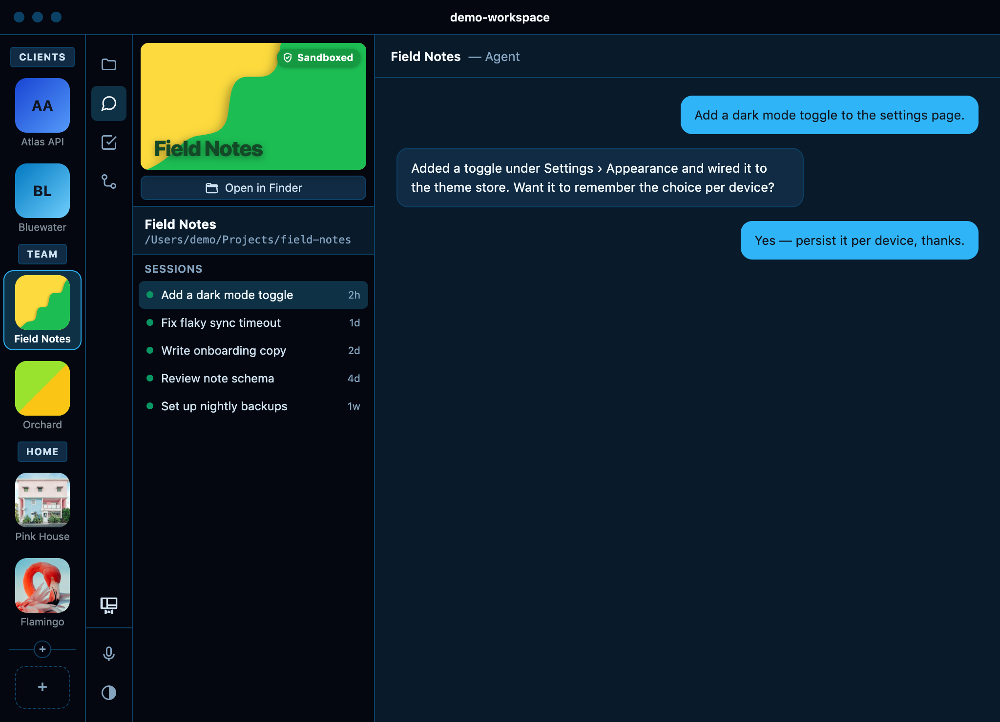
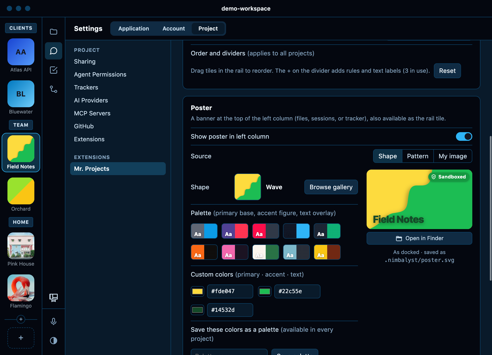

# Mr. Projects

Make each project in [Nimbalyst](https://nimbalyst.com) look like itself: a project rail with names and icons, a poster at the top of the sidebar, and, with [Mr. Themes](https://github.com/Firework-Labs/nimbalyst-mr-themes), its own color theme.

<picture>
  <source media="(prefers-color-scheme: light)" srcset="screenshots/com.fireworklabs.project-theme-0-light.png">
  
</picture>

- Drag projects into your own order and group them with lines and headings
- Pick a poster per project: a shape, a pattern, or your own image
- Optional Sandboxed badge and Open in Finder button
- Settings live in the project (`.nimbalyst/project-theme.json`), so they travel with it

<picture>
  <source media="(prefers-color-scheme: light)" srcset="screenshots/com.fireworklabs.project-theme-1-light.png">
  
</picture>

## Install

In Nimbalyst's extension Marketplace, scroll to **Install from GitHub** and paste:

```
https://github.com/Firework-Labs/nimbalyst-mr-projects
```

Install [Mr. Themes](https://github.com/Firework-Labs/nimbalyst-mr-themes) the same way for per-project themes.

## Good to know

Mr. Projects swaps in its own rail and adds the poster using parts of Nimbalyst that aren't in its extension API, so a Nimbalyst update can break them until Mr. Projects catches up. Turning it off brings back Nimbalyst's own rail. More in [docs/details.md](docs/details.md).

MIT license. Patterns from [Hero Patterns](https://heropatterns.com) by Steve Schoger.
